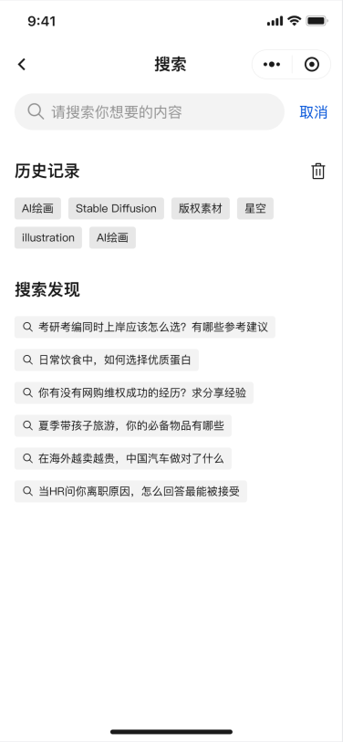

# 搜索页 {#search}

本界面是移动端通用场景页面模板的`搜索页`，可以由`首页`进入，由`顶部导航栏`、`搜索输入模块`、`历史记录模块`和`搜索发现模块`四个模块组成。

## 页面思路 {#design-idea}

- 本页面的视觉稿如图所示：



- 根据视觉稿的特点，按照直观的**移动端视觉从上到下**的顺序，将页面依次划分为`顶部导航栏`、`搜索输入模块`、`历史记录模块`和`搜索发现模块`四个不同的功能模块进行开发。

## 模块功能 {#features}

### 顶部导航栏
- 包含返回上一页面按钮和搜索页标题，标题居中呈现

### 搜索输入模块
- 最基础的输入框功能
- 支持清除按钮快速清空历史输入内容
- 支持输入框右侧的取消按钮，同样用于返回上一页面
- 最大输入长度限制为20字符
- 在输入框具有输入数据后，提供一键清除输入按钮

### 历史记录模块
- 可显示用户的搜索历史
- 支持点击搜索历史标签，以快速填充搜索框
- 提供清除按钮一键删除所有历史记录
- 历史记录采用标签式展示，点击即可复用搜索词
- 模块数据目前直接硬编码在 `hooks.tsx` 中，考虑到这类数据一般存储在用户本地，后续同样可更改为`mock`模拟

### 搜索发现模块
- 展示云端热门搜索建议
- 搜索图标标识每个建议项
- 支持点击建议项快速填充搜索框
- 模块数据目前通过 `mock` 模拟 API 请求获取，考虑到这类数据实际应用中需要从后端服务器获取，后续可根据需求切换为真实后端接口

## 模块结构 {#structure}

### 代码结构
```
src/views/search/
├── index.vue  // 搜索页面的主要组件，包含页面结构和布局
└── hooks.tsx  // 集成了搜索相关的业务逻辑，包括状态管理和事件处理
```

#### index.vue
`index.vue` 是搜索页面的主要组件，包含了页面的结构和布局：
- 使用 `<script setup>` 语法编写组件逻辑
- 导入并使用 `useSearchHook` 自定义钩子获取搜索相关的状态和方法
- 定义路由元信息，设置页面标题
- 模板部分包含顶部导航栏、搜索输入模块、历史记录模块和搜索发现模块
- 自定义组件时，尽量使用 TDesign 组件库的组件实现功能，例如 Search、Tag 和 Icon

#### hooks.tsx
`hooks.tsx` 包含了搜索页面的业务逻辑，使用 Composition API 实现：
- 使用 `ref` 创建响应式状态（搜索值、历史记录、搜索建议）
- 使用 `useRouter` 获取路由实例，实现页面导航
- 定义事件处理函数（取消搜索、清除历史、点击历史标签、点击搜索建议）
- 实现 API 调用函数，获取搜索建议数据
- 通过返回对象暴露状态和方法供组件使用

## 开发指南 {#development-guide}

### 开发前准备
1. 确保已安装项目依赖
2. 熟悉 TDesign Mobile Vue 组件库的使用

### 开发步骤
1. **页面结构开发**：在 `index.vue` 中搭建或修改页面框架，引入所需组件
2. **业务逻辑开发**：在 `hooks.tsx` 中实现搜索相关的状态管理和业务逻辑，在 `index.vue` 中调用相关方法
3. **事件处理**：在模板提供的搜索输入、历史记录点击、搜索建议点击等交互逻辑上进行增添或删除
4. **样式调整**：根据需求调整组件样式，建议尽量使用 TDesign 组件库的默认样式，避免自定义样式导致的兼容性问题

### 扩展建议
1. **历史记录持久化**：目前历史记录硬编码在 `hooks.tsx` 中，可扩展为 localStorage 持久化存储，或通过 `mock` 模拟

## 改进此文档

如果发现有任何错误或可改进之处，您可以[报告问题](https://github.com/TDesignOteam/tdesign-mobile-vue-starter-community/issues)

## 维护者 {#maintainer}

[Tonite14](https://github.com/Tonite14)、[hikari](https://github.com/liuyax0818)
